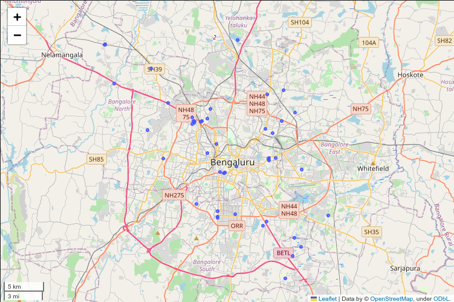
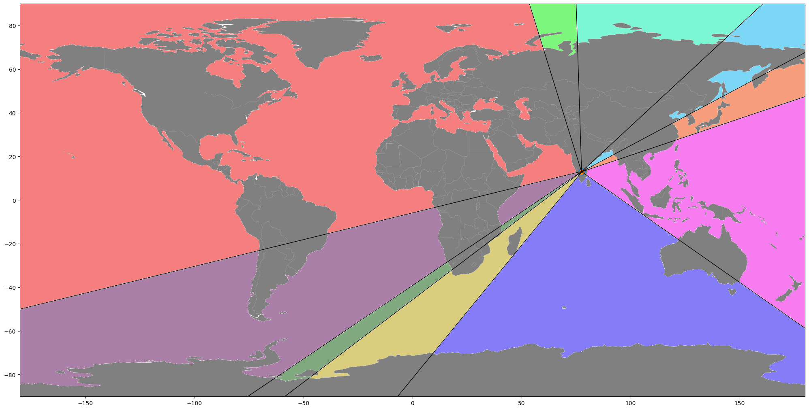
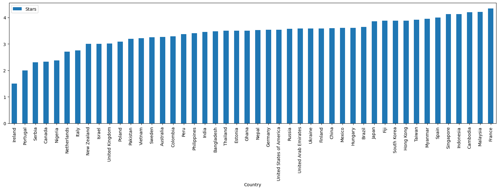
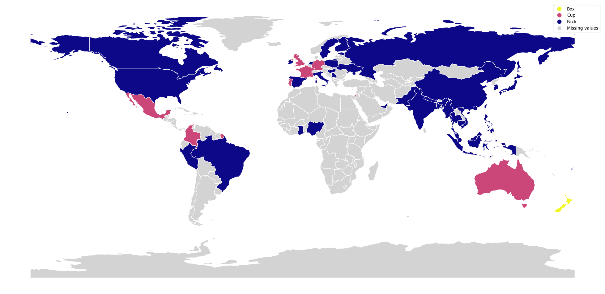

# The Ramen Empire - Onion Warehouse Locator & Ramen Master Data

[Original Website (may or may not be around anymore)](https://canchetadev.wixsite.com/the-ramen-empire)

Greetings and salutations, esteemed culinary connoisseur from lands near and
far. It is with the utmost pleasure that we present to you the culmination of
our tireless efforts - the onion warehouses located in the vibrant city of
Bangalore.

The onion, a vegetable of unparalleled versatility and flavor, is a staple in
kitchens the world over. And we, dear friend, have dedicated ourselves to
sourcing the finest specimens of this noble ingredient for your culinary
enjoyment. We have scoured the land, leaving no stone unturned, in our quest to
find the onion warehouses that are most conveniently located for you in
Bangalore. And, at long last, our search has been successful.

## Our Warehouses

Within the walls of these warehouses lies a veritable treasure trove of onions,
each one plump, firm, and bursting with pungency. Carefully selected and
nurtured, these bulbs are sure to satisfy even the most discerning of palates.
And the sheer quantity of onions contained within these warehouses is enough to
make even the most seasoned chef swoon with delight.

So do not delay, dear friend. Make haste to Bangalore, and visit the onion
warehouses nearest to your location. Bring an empty basket, for we have no doubt
that you will be tempted to fill it to the brim with these delectable bulbs. The
search is over, and the onions of your dreams are within reach. Rejoice, for the
onion warehouses have been found in Bangalore, and your culinary creations are
sure to be elevated to new heights of flavor and excellence.

### Your Closest Location

Warehouses going clockwise starting from the top:

| Colour   | Warehouse                            |
| -------- | ------------------------------------ |
| Cyan     | Onion Wholesale                      |
| Sky Blue | Onion Plaza                          |
| Orange   | Fresh Gallery                        |
| Magenta  | Farmers Bazaar Vegetables and Fruits |
| Indigo   | BSD Traders Onion                    |
| Yellow   | Jaihind Onion Traders                |
| Green    | Fresh N Green Supermarket            |
| Violet   | Reliance Fresh Warehouse             |
| Red      | Gowri Enterprises                    |
| Lime     | Rudreswara Traders                   |

## Serious Gourmet Ramen

Gourmet connoisseurs, prepare to have your minds blown by the ultimate in fine
dining - instant ramen.

This delectable dish is a true work of culinary art, crafted with the highest
quality ingredients and the utmost attention to detail. The noodles, soft yet
toothsome, are the perfect vessel for the rich, savory broth that envelops them.
And the toppings - ah, the toppings. Each one is carefully selected and placed
with artistic precision, adding textural contrast, pops of flavor, and visual
appeal to this already-exceptional dish.

But the true genius of instant ramen lies in its convenience. No longer must you
spend hours toiling over a hot stove, waiting for your broth to reduce and your
noodles to cook to al dente perfection. Simply add hot water, wait a few short
minutes, and voila - a gourmet meal, ready to be savored and enjoyed.

So do not hesitate, discerning diners. Head to your nearest grocery store, and
add a package of instant ramen to your cart. Experience the height of fine
dining in the comfort of your own home, with minimal effort and maximum reward.
Your taste buds - and your busy schedule - will thank you.

### Best Canadian Ramen

| Brand           | Variety                                   | Style | Stars |
| --------------- | ----------------------------------------- | ----- | ----- |
| Plats Du Chef   | Cuisine Adventures Chicken Pho Soup       | Bowl  | 5.0   |
| Sapporo Ichiban | Chow Mein Japanese Style Noodles Yakisoba | Pack  | 5.0   |
| Rooster         | Chili Seafood Flavour                     | Pack  | 4.25  |
| Great Value     | Spicy Ramen Noodles                       | Pack  | 4.0   |
| Rooster         | Chili Chicken Flavour Noodle Soup         | Cup   | 4.0   |
| Rooster         | Chili Chicken Flavour Noodle Soup         | Bowl  | 3.75  |
| Rooster         | Kimchee Flavour Noodle Soup               | Bowl  | 3.75  |
| Western Family  | Instant Noodles Chicken Flavour           | Pack  | 3.5   |
| Azami           | Hot & Spicy Flavour Noodle Soup           | Bowl  | 3.5   |
| Great Value     | Beef Style Ramen Noodles                  | Pack  | 3.5   |
| Great Value     | Chicken Style Noodles With Vegetables     | Cup   | 3.5   |

### Worst Canadian Ramen :(

| Brand          | Variety                                              | Style | Stars |
| -------------- | ---------------------------------------------------- | ----- | ----- |
| Bowlfull       | Beef Flavour Instant Noodle Soup                     | Cup   | 0.0   |
| Bowlfull       | Vegetable Flavour Instant Noodle Soup                | Pack  | 0.0   |
| Mr. Noodles    | Pho Noodle Soup Simulated Beef Flavour               | Bowl  | 0.0   |
| Azami          | Kimchee Flavour Noodle Soup                          | Pack  | 0.0   |
| Western Family | Beef Flavour Instant Noodles                         | Pack  | 0.0   |
| Azami          | Kimchee Noodle Soup                                  | Cup   | 0.0   |
| Campbell's     | Hearty Noodles Thai Flavour                          | Cup   | 0.0   |
| Campbell's     | Hearty Noodles Savoury Beef Flavour                  | Cup   | 0.25  |
| Mr. Noodles    | Chicken Kimchi Oriental Style Noodles With Soup Base | Bowl  | 0.5   |
| Noodle Time    | Spicy Thai                                           | Bowl  | 0.5   |

### Average Rating by Country

### Most Popular Style by Country

